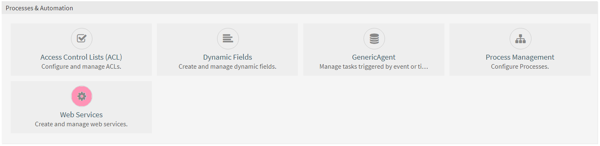
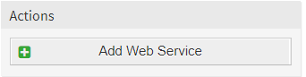
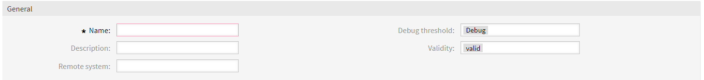
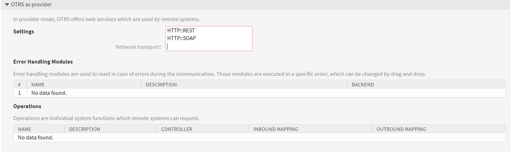
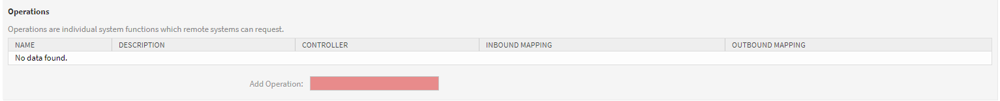
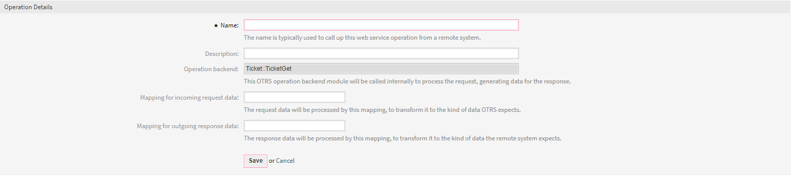
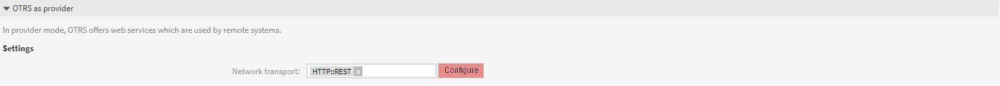
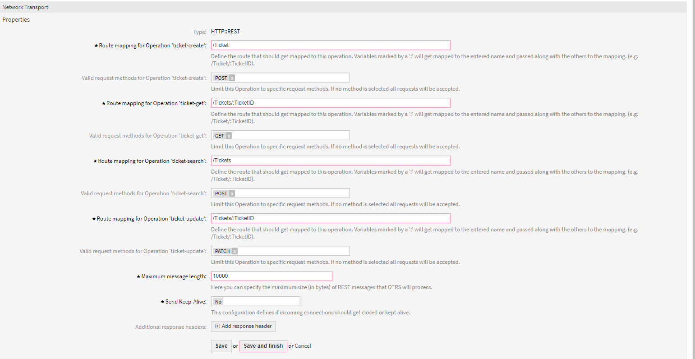

 

# OTRS connector

OTRS connector for the [Mittelstands plattform](https://app.msp-live.external.otc.telekomcloud.com/ "MittelStands platform")

> OTRS is a service management suite that comprises ticketing, workflow automation and notification, 
along with a wide range of customizable features. It is used by IT service management, 
customer service and corporate security help desks to better structure their communication and tasks.

## Use cases
The OTRS connector is a powerful tool and can be used to create a lot of useful flows. 

A more complex use case is one in which the OTRS connector will be integrated with the Jira connector resulting in a complex sync of the two apps. 
We can automatically create OTRS tickets from Jira issues as soon as they are created, and vice-versa. 

Using this connector we can create OTRS articles, add attachments to articles, move ticket to a different queue, all of this while also being able to filter the tickets that we process by date, queue, authors and many others.

## OTRS webservice setup
Before you can use the OTRS connector you need to create a OTRS Web Service and create endpoints for it
by completing the following steps:
1. On your OTRS instance go to the Admin page, by selecting the tab located on the top tabstrip.
 
2. On your admin tab under "Processes and Automation" select "Web Services"
 
3. On the Web Services Management page select Add Web Service, located on the left of the page

4. Give the web service a name "General → Name"
 
5. On the add new web service page under "OTRS as provider → Settings → Network transport" select
HTTP::REST 
 
6. Save the web service by clicking the save button on the bottom of the page
7. Create api endpoints "OTRS as provider → Operations → Add Operation"
 
8. Select the following four operations:
    1. Ticket::TicketCreate
    2. Ticket::TicketGet
    3. Ticket::TicketSearch
    4. Ticket::TicketUpdate
9. Once selecting any of these operations you must name the operation, we recommend naming them: ticket-create, ticket-get, ticket-search and ticket-update; after naming them click "Save" and then "Save and finish"

10. After creating all the operations go to "OTRS as provider → Settings → Configure" located on the right of the previously used "Network Transport"
 
11. Create Route mapping and set the valid request methods for each operation as follows:

    Operation | Route | Request Method
    --------- | ----- | --------------
    ticket-create | /Ticket | POST
    ticket-get | /Tickets/:TicketID | GET
    ticket-search | /Tickets | POST
    ticket-update | /Tickets/:TicketID | PATCH
 

12. On the same page configure "Maximum message length", give it a large number, for example 10000 for 10KB, larger if you expect attachments
13. "Save and finish" the configuration
14. "Save and finish" the webservice

## Setting up credentials
Upon completing the web service setup it's time to configure the OTRS connector
1. On the sidebar on the left got to "Organize → Credentials"
2. Select "+ Add New Credential" located on the right of the page
3. Give your credentials a name
4. Construct the web service url by using the https protocol "https://", the domain of the OTRS instance "otrs-instance.managed-otrs.com" add "/otrs" add "/nph-genericinterface.pl/Webservice" and finally add the name of your webservice "/webservice-name"
  so the final url "https://example.managed-otrs.com/otrs//nph-genericinterface.pl/Webservice/MyWebService"
5. Add your username and password
6. In case you are using custom CA certificates add them in base64

## Using the connector
### actions: 
* addArticle → Updates an OTRS ticket by creating a article, which can also include attachments by adding the download url generated by the platform for the attachment
 (see https://doc.otrs.com/doc/api/otrs/5.0/Perl/Kernel/System/Ticket/Article.pm.html)     
* createTicket → Create a new OTRS Ticket, which will contain an article, metadata and can contain dynamic fields
 (see http://doc.otrs.com/doc/api/otrs/5.0/Perl/Kernel/GenericInterface/Operation/Ticket/TicketCreate.pm.html)
* getTicket → Get ticket based on it's id
(see http://doc.otrs.com/doc/api/otrs/5.0/Perl/Kernel/GenericInterface/Operation/Ticket/TicketGet.pm.html)
* updateTicket → Updates an OTRS ticket data
(see http://doc.otrs.com/doc/api/otrs/5.0/Perl/Kernel/GenericInterface/Operation/Ticket/TicketUpdate.pm.html)
* processAttachments → This action will download ticket attachments and upload them to the platform while also replacing the content field in the ticket object with the newly generated platform url

_Most actions contain a input field called "OTHER" which will allow a user to add any other field to the input by creating a object. In this object the field is the object key and the value is the field value_
  
### triggers:
* getNewTickets → Get all new OTRS tickets which can filtered by the date they were created, the queue they are in. The user can also select on whether the ticket will include all, none or first article and also if it will include the attachments. The output will be an object that contains the ticket and a property called meta which will contain the date that was stored inside of the snapshot
* getUpdateTickets → Functions the same as the getNewTickets trigger but instead of newly created tickets, it retrieves the tickets that have been recently updated

_**For more information about the triggers and actions usage check the extended [documentation](doc/index.html)**_